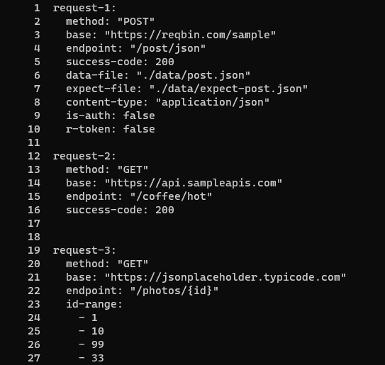

# Wave

Wave is a command line application built using the Cobra CLI framework to load-test RESTful APIs.

## Installation

```bash
# To get the package
go get github.com/fercevik729/Wave

# To install the CLI tool
go install Wave
```

## Usage

```bash
# To check that you correctly installed Wave
wave --version

# To encrypt the credentials file use a 16 character long password
wave protect -e -p "mysecretpassword"

# To decrypt the credentials file use the same 16 character long password
wave protect -p "mysecretpassword"

# To initialize empty setup files and directories
wave init

# To concurrently load test the API use the 'splash' command
wave splash 

# To sequentially test the API use the 'whirl' command
wave whirl

# To output results to a log file use the -o flag
wave splash -o "first.log"

# To set the credentials yaml file use the -c flag
wave whirl -c "./data/my-credentials.yaml"

# To set the iterations use the -i flag
wave splash -i 20 # 20 sets of requests

# To enable verbose output use the -v flag
wave whirl -v

# To set the requests file use the -r flag
wave splash -r "./reqs/first-api-requests.yaml"

# Flags can also be combined
wave splash -r "./requests/first-http.yaml" -i 15 -v -o "first.log"
```
## Writing Requests in YAML
In order for Wave to properly unmarshal the request data into its corresponding structs, users should try to follow the 
following convention: 


* Names for requests, such as "request-1" are arbitrary and only there for the user's accessibility
* The *method* field is **required** and case-insensitive. It supports GET, POST, UPDATE/PATCH, and DELETE requests
* The *base* field is **required**. It specifies the base url of the API the user is trying to connect to
* The *endpoint* field is **required**. It specifies the endpoint the user is sending a request to. It supports
```{id}``` notation for requests with id ranges
* The *success-code* field is **required**. It specifies the status code that will specify if the request was successful.
It will typically be a 2** code.
* The *id-range* field is used for requests that are meant to iterate over a certain range of numbers. The first number
represents the starting id and the second number represents the last id. The last id should be greater than the first id.
If the user seeks to iterate over multiple ids that aren't numeric or not in order, they need to specify three or more
ids in total.
* The *data-file* field represents the file containing the payload to be sent to the API
* The *expect-file* field represents the file containing the expected response payload. It is used to test if a request was
successful
* The *content-type* field is the content type of the payload being sent to the API
* The *is-auth* field specifies if the request will be used to authenticate a user and if so, it will retrieve the token
in the response body for later requests. It will use the username and password from the credentials file
* The *r-token* field specifies if a request needs a token and if so, retrieves the api token from the credentials file

Note that it is fine to omit some fields but the program won't work if the "method", "base", "endpoint", and
"success-code" are not filled. It is also fine if the user decides to put some fields out of order.

## Contributing
Pull requests are welcome. For major changes, please open an issue first to discuss what you would like to change.

## Future ideas
* Enable the creation of test-suites in YAML
* Enable encrypting data files

## License
© Furkan T. Ercevik

This repository is licensed with a [GNU GPLv3](LICENSE) license.
